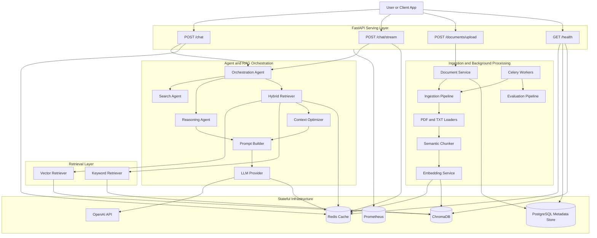

# Neural Knowledge Engine

Neural Knowledge Engine is an enterprise-grade Retrieval Augmented Generation platform for private document intelligence. The codebase models a FAANG-style backend with modular ingestion, semantic chunking, cached embeddings, hybrid retrieval, agent-driven orchestration, streaming responses, background workers, evaluation pipelines, and observable infrastructure.

The repository is intentionally structured like a production platform rather than a demo. FastAPI serves the online inference surface, ChromaDB stores vectorized chunks, Redis backs query and embedding caches, PostgreSQL stores document metadata, Celery handles background ingestion and evaluation, and Prometheus can scrape service metrics.

## Architecture

Core runtime flow:

1. `POST /chat` receives a user question.
2. The orchestration agent decides whether retrieval is required and refines the query.
3. The retrieval layer performs vector search and keyword search.
4. The hybrid retriever merges scores and returns top ranked chunks.
5. The context optimizer compresses the context window.
6. The prompt builder constructs the final grounded prompt.
7. The LLM provider executes retryable OpenAI calls and streams when requested.
8. The API returns the answer with source references.

Offline and background flow:

1. Documents are uploaded or ingested from disk.
2. PDF and TXT loaders normalize raw content.
3. The semantic chunker creates embedding-ready chunks.
4. Cached embeddings are generated and written to ChromaDB.
5. PostgreSQL records document metadata.
6. Celery workers can run ingestion and evaluation asynchronously.

## RAG Diagram



## Repository Structure

```text
neural-knowledge-engine/
|
+-- app/
|   +-- api/v1/
|   |   +-- chat_routes.py
|   |   +-- document_routes.py
|   |   +-- health_routes.py
|   +-- core/
|   |   +-- config.py
|   |   +-- settings.py
|   |   +-- logging.py
|   +-- ingestion/
|   |   +-- loaders/
|   |   |   +-- pdf_loader.py
|   |   |   +-- text_loader.py
|   |   +-- chunking/
|   |   |   +-- semantic_chunker.py
|   |   +-- ingestion_pipeline.py
|   +-- embeddings/
|   |   +-- embedding_service.py
|   +-- vectorstore/
|   |   +-- vector_repository.py
|   +-- retrieval/
|   |   +-- vector_retriever.py
|   |   +-- keyword_retriever.py
|   |   +-- hybrid_retriever.py
|   +-- rag/
|   |   +-- prompt_builder.py
|   |   +-- rag_pipeline.py
|   |   +-- context_optimizer.py
|   +-- agents/
|   |   +-- reasoning_agent.py
|   |   +-- search_agent.py
|   |   +-- orchestration_agent.py
|   +-- llm/
|   |   +-- llm_provider.py
|   +-- services/
|   |   +-- chat_service.py
|   |   +-- document_service.py
|   +-- cache/
|   |   +-- redis_cache.py
|   +-- evaluation/
|   |   +-- rag_metrics.py
|   |   +-- evaluation_pipeline.py
|   +-- main.py
|
+-- workers/
|   +-- ingestion_worker.py
|
+-- scripts/
|   +-- ingest_documents.py
|   +-- evaluate_rag.py
|
+-- data/documents/
+-- tests/
+-- infrastructure/docker/Dockerfile
+-- infrastructure/monitoring/prometheus.yml
+-- docker-compose.yml
+-- requirements.txt
+-- .env.example
+-- Makefile
+-- README.md
```

## Setup

Use Python 3.11.

```bash
python -m venv .venv
.venv\Scripts\activate
pip install -r requirements.txt
cp .env.example .env
```

Populate `.env` with a valid `OPENAI_API_KEY`. The Docker Compose stack already provisions Redis and PostgreSQL for local development.

## Key Platform Components

- Document ingestion pipeline with dedicated PDF and TXT loaders
- Semantic chunking tuned for $500$-$1000$ token windows
- Cached embedding generation using Redis-backed keys
- ChromaDB vector store for semantic retrieval
- Hybrid ranking that merges vector similarity and keyword overlap
- Search, reasoning, and orchestration agents for multi-step control
- Streaming Server-Sent Events for low-latency responses
- Celery tasks for ingestion and evaluation
- Prometheus metrics endpoint at `/metrics`
- Structured JSON logging with request correlation IDs

## Ingestion Instructions

Ingest the default document folder:

```bash
make ingest
```

Or ingest a custom path:

```bash
python -m scripts.ingest_documents --path data/documents --reset
```

You can also upload documents directly through the API using `POST /documents/upload`.

## Evaluation Instructions

Prepare a JSON evaluation dataset with records like:

```json
[
  {
    "question": "What is the refund policy?",
    "expected_sources": ["policy.txt"]
  }
]
```

Then run:

```bash
make evaluate
```

Or:

```bash
python -m scripts.evaluate_rag --dataset data/evaluation/rag_eval.json --output evaluation_report.json
```

The evaluation pipeline computes answer relevance, faithfulness, context precision, and retrieval recall.

## API Usage

Start the API locally:

```bash
make run
```

Health endpoint:

```http
GET /health
```

Chat endpoint:

```http
POST /chat
Content-Type: application/json
```

```json
{
  "question": "Summarize the document retention policy."
}
```

Streaming endpoint:

```http
POST /chat/stream
Accept: text/event-stream
```

Upload endpoint:

```http
POST /documents/upload
Content-Type: multipart/form-data
```

## Example Queries

- "What are the escalation steps for customer data incidents?"
- "Summarize the reimbursement approval workflow."
- "Which document mentions retention requirements for contracts?"

## Docker Infrastructure

Run the full platform:

```bash
docker-compose up --build
```

This starts:

- FastAPI application
- Celery worker
- Redis cache and broker
- PostgreSQL metadata store
- Prometheus monitoring

## Makefile Targets

- `make run`
- `make ingest`
- `make test`
- `make evaluate`
- `make worker`
- `make docker-up`
- `make docker-down`

## Testing

```bash
make test
```

## License

MIT
